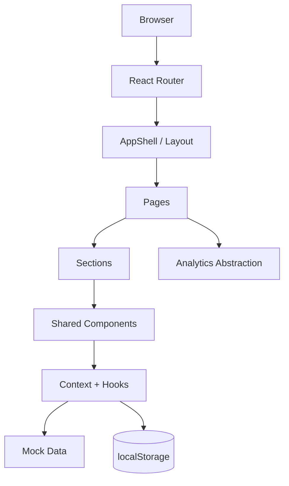

# BookLoop MUI Frontend Technology Stack

เอกสารนี้กำหนด technology stack โดยมี **MUI เป็นแกนหลักของ Frontend** สำหรับ BookLoop ซึ่งเป็น React e-commerce / marketplace prototype สำหรับสาธิต Social Media Marketing

## สถานะเอกสาร

- **สถานะ:** Planned — Frontend Prototype
- **ขอบเขต:** Web frontend และ demo interactions
- **Frontend priority:** MUI-first
- **Backend:** ยังไม่มี
- **Database:** ยังไม่มี
- **Payment:** ยังไม่มีระบบชำระเงินจริง
- **ข้อมูลผู้ใช้จริง:** ไม่เก็บ

> ตัวเลขสินค้า ผู้ขาย รีวิว สมาชิก และ social proof ทั้งหมดใน prototype ต้องระบุว่าเป็น `Demo` หรือ `Mock Data` หากยังไม่ได้มาจากระบบจริง

## หลักการสำคัญ: MUI-first Frontend

BookLoop ต้องพัฒนาโดยให้ MUI เป็น UI foundation หลัก ไม่ใช่เพียง library ที่ติดตั้งไว้:

1. ใช้ MUI components สำหรับ layout, navigation, form, card, feedback และ responsive behavior ก่อนสร้าง component เอง
2. ใช้ `ThemeProvider` และ `createTheme` เป็นแหล่งกำหนดสี typography spacing radius shadow และ component variants กลาง
3. ใช้ `sx` หรือ Emotion สำหรับ custom styling ที่จำเป็น โดยต้องอิง token จาก MUI theme
4. ใช้ `@mui/icons-material` เป็น icon system เดียวกันทั้งแอป ยกเว้น logo/brand mark ที่เป็น custom asset
5. ห้ามเพิ่ม Bootstrap, Tailwind หรือ UI library ชุดอื่นมาทับ MUI โดยไม่มีเหตุผลที่บันทึกไว้
6. ห้ามเขียน CSS ซ้ำเพื่อเลียนแบบ component ที่ MUI มีให้ใช้อยู่แล้ว
7. custom component ต้อง compose จาก MUI และรักษา keyboard, focus, responsive และ accessibility behavior

ลำดับการเลือกวิธีสร้าง UI:

```text
MUI component
→ MUI theme / sx
→ Emotion styled component
→ plain CSS เฉพาะกรณีที่จำเป็นจริง
```

## 1. ภาพรวม Stack

| Layer | Technology | หน้าที่ |
| --- | --- | --- |
| Language | JavaScript / JSX หรือ TypeScript / TSX | เขียน logic และ UI ของ frontend |
| UI runtime | React 19 | สร้าง component และจัดการการ render |
| Build tool | Vite 8 + Rolldown ตามที่ environment รองรับ | development server, build และ asset bundling |
| Routing | React Router | จัดการหน้า Home, Books, Product, Sell, About, Campaign และ Cart |
| UI system | MUI v9 | component, layout, responsive breakpoint และ theme |
| UI icons | `@mui/icons-material` v9 | icon สำหรับ navigation, search, cart, wishlist, filter และ feedback |
| Styling | Emotion | custom styling ที่ทำงานร่วมกับ MUI |
| Animation | Framer Motion | page reveal, hover, scroll reveal และ BookLoop flow |
| Alert / feedback | SweetAlert2 | confirmation, success, warning และ error dialog |
| State | React Context + hooks | cart, wishlist และ shared client state |
| Persistence | Browser `localStorage` | เก็บ cart และ wishlist ใน prototype |
| Quality | Oxlint | ตรวจปัญหา JavaScript/React และ code quality |
| Test target | Browser manual test + automated tests ตามความเหมาะสม | ตรวจ user journey และ regression |

## 2. เหตุผลที่เลือกเทคโนโลยี

### React 19

ใช้สร้าง UI แบบ component-based แยกส่วนซ้ำได้ เช่น `BookCard`, `Header`, `SellerCard`, `PriceComparison` และ `ReviewList` ทำให้หน้า Home, Books และ Product Detail ใช้ design language เดียวกัน

### Vite 8 / Rolldown

ใช้เป็น development server และ build tool เพราะเริ่มโปรเจกต์ได้เร็ว ใช้ configuration ไม่ซับซ้อน และเหมาะกับ frontend SPA ที่ต้องการ feedback เร็วระหว่างพัฒนา

หาก Vite 8 หรือ Rolldown ไม่สามารถติดตั้งร่วมกับ environment ได้ ให้ใช้เวอร์ชันที่ compatible ที่สุด ห้ามทำให้ project รันไม่ได้ และต้องบันทึกเหตุผลไว้ใน README

### React Router

ทำให้แต่ละหน้ามี URL ที่แชร์และเปิดโดยตรงได้ รองรับ product id, search query และ filter state เช่น:

```text
/books?q=นิยาย
/books?category=ธุรกิจ&sort=price-low
/books/book-001
```

### MUI v9 + Emotion

ใช้เป็น design system กลางเพื่อควบคุม typography, color, spacing, button, card, drawer, input, dialog และ responsive breakpoint ไม่ควรสร้าง UI system ซ้ำด้วย CSS กระจัดกระจาย

### Framer Motion

ใช้เฉพาะ animation ที่ช่วยให้ผู้ใช้เข้าใจลำดับของหน้า เช่น Hero reveal, product hover และ `ซื้อ → อ่าน → ขายต่อ → ส่งต่อ → อ่านต่อ` ไม่ใช้ animation มากจนรบกวน search หรือ checkout

### SweetAlert2

ใช้กับ action ที่ต้องการ feedback เด่นหรือการยืนยัน เช่น:

- เพิ่มสินค้าลงตะกร้าสำเร็จ
- เพิ่ม/ลบ wishlist
- ยืนยันการลบสินค้า
- ยืนยัน demo checkout
- submit Sell Form แบบ demo
- warning เมื่อสินค้าไม่มี stock

ห้ามใช้ native `alert()`, `confirm()` หรือ `prompt()`

### Oxlint

ใช้ตรวจ code quality ระหว่างพัฒนาและก่อนส่งมอบ โดยควรมี script เช่น:

```bash
npm run lint
```

## 3. Package ที่ต้องใช้

ตัวอย่าง dependency หลัก:

```bash
npm install react@19 react-dom@19 react-router-dom @mui/material@9 @mui/icons-material@9 @emotion/react @emotion/styled framer-motion sweetalert2
```

ตัวอย่าง development dependency:

```bash
npm install -D oxlint
```

ถ้าโปรเจกต์ถูก scaffold ด้วย Vite อยู่แล้ว ไม่ต้องติดตั้ง `react` และ `react-dom` ซ้ำ ให้ตรวจ `package.json` ก่อนเสมอ

## 3.1 MUI Components ที่จำเป็นสำหรับ BookLoop

ใช้ MUI เป็นระบบ UI หลักตามรายการ component ทางการของ MUI โดยเลือกเฉพาะ component ที่ช่วยให้ BookLoop สร้างหน้า e-commerce, form, responsive navigation และ feedback ได้ครบ ไม่จำเป็นต้องติดตั้ง MUI X หรือ component ทุกชนิดตั้งแต่เริ่มต้น [ดูรายการ MUI components ทั้งหมด](https://mui.com/material-ui/all-components/)

### Layout และ foundation

| Component | ใช้กับ |
| --- | --- |
| `CssBaseline` | reset และ baseline style ของแอป |
| `ThemeProvider` | ส่ง theme กลางให้ทุกหน้า |
| `Container` | จำกัดความกว้างและจัดแนวเนื้อหา |
| `Box` | wrapper และ custom layout ขนาดเล็ก |
| `Stack` | จัดระยะห่างแนวตั้ง/แนวนอน |
| `Grid` | responsive product/category layout |
| `Paper` | surface ที่ต้องการแยกจาก background |
| `Divider` | แบ่งกลุ่มข้อมูล เช่น detail และ cart |

### Navigation และ page structure

| Component | ใช้กับ |
| --- | --- |
| `AppBar` / `Toolbar` | sticky header และ top navigation |
| `Drawer` | mobile menu และ mobile filter |
| `Menu` / `MenuItem` | account menu, sort menu และ action menu |
| `Breadcrumbs` | บอกตำแหน่งใน Books และ Product Detail |
| `Link` | ลิงก์ภายใน/ภายนอกที่เข้าถึงได้ |
| `Tabs` / `Tab` | แบ่งรายละเอียดหนังสือ เช่นข้อมูล/รีวิว |
| `Pagination` | แบ่งผลลัพธ์ใน Books listing เมื่อจำเป็น |
| `Accordion` | condition guide, FAQ และข้อมูลยาวบน mobile |

### E-commerce และ data display

| Component | ใช้กับ |
| --- | --- |
| `Card`, `CardMedia`, `CardContent`, `CardActions` | Book Card, Social Card และ Related Books |
| `Typography` | heading, body, price และ metadata |
| `Chip` | category, condition, verified และ active filter |
| `Avatar` | seller profile และ customer review |
| `Badge` | จำนวนสินค้าใน cart และ notification count |
| `Rating` | rating หนังสือและ seller rating |
| `List`, `ListItem`, `ListItemText` | cart item, review list และ seller information |
| `Tooltip` | อธิบาย icon action ที่ไม่ควรเพิ่มข้อความยาว |
| `ImageList` | gallery หรือ image collection ถ้าเหมาะกับ layout |

### Form, search และ filter

| Component | ใช้กับ |
| --- | --- |
| `TextField` | search, sell form และ input ทั่วไป |
| `InputAdornment` | search icon, currency prefix และ action ใน input |
| `Autocomplete` | search suggestion หรือ ISBN lookup ในอนาคต |
| `Select`, `FormControl`, `InputLabel` | category, condition และ sort |
| `Slider` | price range filter |
| `Checkbox`, `FormControlLabel` | multi-category/filter และ preference |
| `RadioGroup`, `Radio` | เลือก condition หรือ shipping option ในอนาคต |
| `Button` | CTA, submit, add-to-cart และ navigation action |
| `IconButton` | favorite, close, menu, quantity และ gallery control |

### Feedback และ state

| Component | ใช้กับ |
| --- | --- |
| `Alert` | inline error, warning และ information |
| `Snackbar` | feedback สั้น ๆ ที่ไม่ต้องหยุด flow |
| `Dialog` | dialog ภายในระบบที่ต้อง render content หรือ form |
| `Skeleton` | loading state ของ card, gallery และ text |
| `CircularProgress` / `LinearProgress` | loading ระหว่าง action หรือ submit |
| `Backdrop` | loading ที่ต้องป้องกันการกดซ้ำชั่วคราว |

SweetAlert2 ใช้แยกจาก MUI สำหรับ confirmation หรือ success/error ที่ต้องเด่น เช่นยืนยันลบสินค้าและยืนยัน demo checkout ไม่ควรใช้ `Dialog`, `Snackbar` และ SweetAlert2 ซ้อนกันสำหรับ action เดียว

### Components ที่ยังไม่จำเป็นใน prototype

ยังไม่ต้องเพิ่ม MUI X Data Grid, Charts, Date/Time Pickers, Tree View, Speed Dial หรือ component จาก Lab เว้นแต่ requirement ใหม่ต้องใช้จริง เพราะ catalog และ analytics ปัจจุบันเป็น mock data แบบเรียบง่าย การตัด component ที่ไม่จำเป็นช่วยลด bundle size และลดความซับซ้อนของโปรเจกต์

## 3.2 MUI Icons ที่ต้องใช้

ติดตั้งจาก package:

```bash
npm install @mui/icons-material@9
```

กลุ่ม icon ที่แนะนำ:

| กลุ่ม | Icons |
| --- | --- |
| Brand / content | `MenuBook`, `Loop`, `AutoStories`, `BookOutlined` |
| Navigation | `Menu`, `Close`, `ArrowBack`, `ArrowForward`, `ChevronLeft`, `ChevronRight`, `ExpandMore` |
| Search / filter | `Search`, `FilterList`, `Sort`, `Tune`, `Clear` |
| Commerce | `ShoppingCartOutlined`, `AddShoppingCart`, `FavoriteBorder`, `Favorite`, `Remove`, `Add`, `DeleteOutline` |
| Account / seller | `PersonOutline`, `AccountCircle`, `Storefront`, `Verified`, `LocalOfferOutlined` |
| Book detail | `Star`, `StarBorder`, `Visibility`, `InfoOutlined`, `Share`, `PhotoCamera`, `UploadFile` |
| Feedback | `CheckCircleOutline`, `ErrorOutline`, `WarningAmber`, `HelpOutline` |

ตัวอย่าง import:

```jsx
import AddShoppingCartIcon from '@mui/icons-material/AddShoppingCart';
import FavoriteBorderIcon from '@mui/icons-material/FavoriteBorder';
import SearchIcon from '@mui/icons-material/Search';
```

กฎการใช้ icon:

- icon-only button ต้องมี `aria-label` เสมอ
- ใช้ `Tooltip` กับ icon ที่ผู้ใช้ใหม่อาจไม่เข้าใจ
- ปุ่ม action หลัก เช่น `ค้นหาหนังสือ`, `เพิ่มลงตะกร้า` ควรมีข้อความร่วมกับ icon ไม่ใช้ icon อย่างเดียว
- ใช้ icon จาก MUI ให้เป็นชุดเดียวกันทั้งแอป และกำหนด `fontSize`/สีผ่าน theme หรือ `sx`
- ใช้ `currentColor` และอย่ากำหนดสี icon แบบสุ่มในแต่ละหน้า
- โลโก้ BookLoop สามารถเป็น custom SVG/asset แยกจาก MUI Icons ได้
- ห้ามใช้ icon เพื่อสื่อความหมายด้วยสีอย่างเดียว ต้องมี label, text หรือ accessible name

## 3.3 MUI composition ตามหน้าเว็บ

| หน้า | MUI ที่เป็นแกนหลัก |
| --- | --- |
| Home / Landing | `AppBar`, `Container`, `Stack`, `Grid`, `Card`, `Button`, `Chip`, `Paper`, `Typography` |
| Books listing | `TextField`, `InputAdornment`, `Select`, `Slider`, `Chip`, `Drawer`, `Grid`, `Card`, `Pagination` |
| Product Detail | `Breadcrumbs`, `Grid`, `ImageList`, `IconButton`, `Chip`, `Rating`, `Tabs`, `Accordion`, `Avatar`, `Divider` |
| Sell | `TextField`, `Select`, `FormControl`, `InputLabel`, `RadioGroup`, `Button`, `Alert`, `Paper` |
| About | `Container`, `Stack`, `Paper`, `Card`, `Stepper` หรือ custom MUI composition, `Button` |
| Campaign | `Container`, `Card`, `Chip`, `Stack`, `Button`, `Avatar`, `Divider`, `Paper` |
| Cart | `List`, `ListItem`, `IconButton`, `TextField`, `Divider`, `Paper`, `Alert`, `Button`, `Badge` |

ให้เริ่มจาก MUI component ที่เหมาะกับหน้าที่ แล้วค่อยปรับ visual ด้วย theme และ `sx` หลีกเลี่ยงการสร้าง HTML/CSS layout ใหม่ทั้งหมดหาก MUI component รองรับอยู่แล้ว

## 4. Scripts ที่แนะนำ

```json
{
  "scripts": {
    "dev": "vite",
    "build": "vite build",
    "preview": "vite preview",
    "lint": "oxlint ."
  }
}
```

หากใช้ TypeScript ให้เพิ่ม typecheck script ที่ตรงกับ project configuration เช่น `tsc --noEmit`

## 5. Frontend Architecture



### โครงสร้างไฟล์ที่แนะนำ

```text
src/
├── app/
│   ├── App.jsx
│   ├── providers.jsx
│   └── router.jsx
├── components/
│   ├── brand/
│   ├── books/
│   ├── cart/
│   ├── feedback/
│   └── navigation/
├── layouts/
├── pages/
│   ├── HomePage.jsx
│   ├── BooksPage.jsx
│   ├── ProductDetailPage.jsx
│   ├── SellPage.jsx
│   ├── AboutPage.jsx
│   ├── CampaignPage.jsx
│   └── CartPage.jsx
├── sections/
├── data/
│   ├── books.js
│   ├── categories.js
│   ├── socialPosts.js
│   └── testimonials.js
├── hooks/
│   ├── useCart.js
│   ├── useWishlist.js
│   └── useBookSearch.js
├── theme/
│   ├── theme.js
│   └── tokens.js
├── utils/
│   ├── alerts.js
│   ├── analytics.js
│   ├── currency.js
│   └── storage.js
├── assets/
└── main.jsx
```

หาก repository มีโครงสร้างที่ดีอยู่แล้ว ให้รักษา convention เดิมและปรับชื่อให้สอดคล้องกับระบบ ไม่ควรย้ายไฟล์จำนวนมากโดยไม่จำเป็น

## 6. Routes

| Route | หน้าที่ | สถานะที่ต้องรองรับ |
| --- | --- | --- |
| `/` | Landing Page / Home | hero, search, category, featured books, campaign, funnel |
| `/books` | ค้นหาและกรองหนังสือ | query, filter, sort, empty result |
| `/books/:id` | Product Detail | gallery, condition, price, seller, review, cart |
| `/sell` | ลงขายหนังสือแบบ demo | form, validation, success |
| `/about` | Brand story และความน่าเชื่อถือ | story, brand loop, CTA |
| `/campaign/read-share-repeat` | Campaign landing จาก Social Media | campaign content, UGC, share, CTA |
| `/cart` | Cart และ demo checkout | quantity, remove, totals, empty, success |

ทุก route ต้องเปิดโดยตรงได้ใน development server และใช้ `Link`/`NavLink` ของ React Router แทนการ reload หน้าโดยไม่จำเป็น

## 7. Data Storage ปัจจุบัน

### 7.1 Catalog data

เก็บหนังสือในไฟล์ mock data เช่น:

```text
src/data/books.js
```

ข้อมูลหลักของหนังสือควรมี:

```js
{
  id,
  title,
  author,
  category,
  cover,
  images,
  price,
  originalPrice,
  condition,
  rating,
  reviewCount,
  stock,
  seller,
  publisher,
  publishedYear,
  isbn,
  pages,
  language,
  defects,
  sellerNote,
  story,
  featured
}
```

Catalog data เป็น static mock data และไม่มีการบันทึกกลับไปที่ server

### 7.2 Cart

Cart ใช้ React Context หรือ hook กลางเป็น source of truth ใน runtime และ sync ไปยัง `localStorage` เพื่อให้ refresh แล้วรายการยังอยู่ใน prototype

แนะนำ key:

```text
bookloop_cart
```

ต้องเก็บเฉพาะข้อมูลที่จำเป็น เช่น `productId` และ `quantity` แล้ว lookup รายละเอียดสินค้าจาก catalog data ไม่ควร copy product object ทั้งก้อนลง storage เพราะข้อมูลอาจไม่ตรงกันเมื่อ catalog เปลี่ยน

### 7.3 Wishlist

Wishlist ใช้ state กลางและเก็บเป็นรายการ `productId` ใน `localStorage`

แนะนำ key:

```text
bookloop_wishlist
```

### 7.4 Search และ filter

Search/filter คำนวณจาก catalog data ใน memory ส่วนค่าที่ผู้ใช้ควบคุมและควรแชร์ URL ได้ให้เก็บใน query string:

```text
q
category
condition
sort
minPrice
maxPrice
```

### 7.5 Sell Form

Sell Form เป็น demo interaction ยังไม่บันทึกเป็นสินค้าจริง หากต้องเก็บค่าไว้ชั่วคราวเพื่อ preview สามารถใช้ React state ได้ แต่ต้องไม่ทำให้ผู้ใช้เข้าใจว่าหนังสือถูกลงขายบน marketplace จริง

### 7.6 Analytics

สร้าง `trackEvent(name, payload)` เป็น abstraction กลาง อาจ log เฉพาะ development หรือเก็บใน memory ใน prototype ห้ามส่งข้อมูลไป analytics provider ภายนอกโดยไม่ได้รับอนุญาต

Events ที่รองรับ:

```text
view_home
search_book
view_category
view_product
favorite_book
add_to_cart
begin_checkout
purchase_demo
share_product
sell_book_click
sell_book_submit_demo
campaign_view
campaign_click
social_share
review_submit_demo
```

## 8. State Management

แบ่ง state ตามความรับผิดชอบ:

| State | ที่เก็บ | ตัวอย่าง |
| --- | --- | --- |
| UI state | component state | mobile menu, selected image, dialog |
| URL state | React Router query params | search, category, sort |
| Shared client state | Context + hooks | cart, wishlist |
| Persistent demo state | `localStorage` | cart, wishlist |
| Server state | ยังไม่มี | products จริง, users, orders |

กฎสำคัญ:

- อย่าเก็บ state เดียวกันซ้ำหลายจุดโดยไม่มีเหตุผล
- คำนวณ subtotal, saving และ total จาก cart state ปัจจุบัน
- ตรวจ stock ก่อนเพิ่มหรือเพิ่มจำนวน
- handle กรณี `localStorage` ใช้งานไม่ได้หรือข้อมูลเสียรูปแบบด้วย fallback ที่ปลอดภัย
- อย่าเก็บ password, payment information, token หรือ PII ใน localStorage

## 9. Theme และ Visual System

ใช้ MUI theme เป็น source of truth:

```text
Ink / Navy       #102A43
Deep Navy       #0B1F33
Action Blue     #1769AA
Soft Blue       #E8F1F8
Paper           #FFFFFF
Warm Surface    #F7F9FB
Muted Text      #52606D
Border          #D9E2EC
Success         #2E7D5B (ใช้เป็นสถานะเท่านั้น)
Warning         #B7791F
Danger          #B42318
```

Theme ต้องกำหนดอย่างน้อย:

- color palette
- typography และ Thai font fallback
- spacing
- border radius
- button variants
- card style
- input style
- focus state
- breakpoint
- shadow ที่เบาและสม่ำเสมอ

ตัวอย่าง theme setup:

```jsx
import { createTheme, CssBaseline, ThemeProvider } from '@mui/material';

export const theme = createTheme({
  palette: {
    primary: { main: '#102A43' },
    secondary: { main: '#1769AA' },
    background: { default: '#F7F9FB', paper: '#FFFFFF' }
  },
  shape: { borderRadius: 12 },
  components: {
    MuiButton: {
      defaultProps: { disableElevation: true },
      styleOverrides: { root: { textTransform: 'none' } }
    },
    MuiCard: {
      styleOverrides: { root: { borderRadius: 16 } }
    }
  }
});

export function AppTheme({ children }) {
  return (
    <ThemeProvider theme={theme}>
      <CssBaseline />
      {children}
    </ThemeProvider>
  );
}
```

ทุก custom component ควรใช้ theme นี้ผ่าน `sx`, `styled` หรือ component variants แทนการกำหนดค่าสี/spacing แบบกระจายตัว

ห้ามใช้สีเขียวเป็นสีหลัก ห้ามใช้ gradient รุนแรง, neon, 3D UI หรือ glassmorphism หนัก

## 10. Responsive และ Accessibility

### Responsive targets

ตรวจอย่างน้อย:

- Mobile ประมาณ 360px
- Tablet ประมาณ 768px
- Desktop ประมาณ 1280px ขึ้นไป

ข้อกำหนด:

- ไม่มี horizontal scroll
- mobile ใช้ navigation drawer และ filter drawer
- card grid ปรับจำนวนคอลัมน์ตาม breakpoint
- CTA และ touch target กดง่าย
- Product Detail เรียง gallery, information และ CTA ใหม่อย่างเหมาะสม
- Cart และ price comparison อ่านได้โดยไม่ต้อง zoom

### Accessibility

- semantic landmarks และ heading hierarchy ถูกต้อง
- ทุก image มี meaningful alt หรือกำหนดเป็น decorative อย่างถูกต้อง
- icon-only button มี `aria-label`
- form field มี label, helper text และ error message
- keyboard navigation และ visible focus state
- contrast เพียงพอ
- dialog/drawer จัดการ focus และ Escape
- รองรับ `prefers-reduced-motion`

## 11. Feedback และ Error Handling

ใช้ SweetAlert2 กับ confirmation หรือ feedback สำคัญ และใช้ MUI Snackbar/inline status สำหรับ feedback สั้น ๆ

ตัวอย่าง:

```js
import Swal from 'sweetalert2';

await Swal.fire({
  icon: 'success',
  title: 'เพิ่มหนังสือลงตะกร้าแล้ว',
  confirmButtonText: 'ดูตะกร้า',
  confirmButtonColor: '#1769AA'
});
```

ต้องมี state อย่างน้อย:

- loading / skeleton
- no search result
- empty cart
- product not found
- form validation error
- out of stock
- demo purchase success

ข้อความ error ต้องบอกว่าเกิดอะไรขึ้นและผู้ใช้ทำอะไรต่อได้ ห้ามใช้ข้อความกำกวมอย่างเดียว เช่น `เกิดข้อผิดพลาด`

## 12. Performance และ Asset Rules

- ใช้ภาพขนาดเหมาะสมกับพื้นที่แสดงผล
- มี fallback เมื่อรูปภาพโหลดไม่ได้
- ใส่ `loading="lazy"` ให้รูปที่อยู่นอก viewport เมื่อเหมาะสม
- หลีกเลี่ยง animation ที่ทำให้ interaction ช้าลง
- อย่า import library ขนาดใหญ่โดยไม่มีเหตุผล
- ใช้ code splitting หรือ lazy route เมื่อจำนวนหน้า/asset เพิ่มขึ้น
- ไม่ใช้ภาพหรือ asset ที่ไม่มีสิทธิ์ใช้งาน
- หากใช้ remote image ใน demo ต้องมี fallback asset และ alt text

## 13. ความปลอดภัยและข้อจำกัดของ Prototype

ระบบปัจจุบันเป็น frontend prototype:

- ไม่มี authentication จริง
- ไม่มี authorization จริง
- ไม่มี database
- ไม่มี payment gateway
- ไม่มี order fulfillment
- ไม่มี seller verification จริง
- ไม่มีการเก็บ PII
- ไม่มี analytics provider จริง

ห้ามแสดงข้อความหรือ UI ที่ทำให้ผู้ใช้เข้าใจว่าธุรกรรมเกิดขึ้นจริง ข้อมูล demo ต้องติดป้ายให้เห็นได้เมื่อมีโอกาสสับสน

เมื่อเชื่อม backend ในอนาคต ต้องย้าย logic สำคัญออกจาก browser และเพิ่ม validation ฝั่ง server, authentication, authorization, rate limiting, secure session, audit log และการปกป้องข้อมูลส่วนบุคคล

## 14. แนวทางต่อยอดเป็น Production

เมื่อเปลี่ยนจาก prototype เป็นระบบจริง ให้เพิ่ม:

1. **Backend API** — จัดการ catalog, user, seller, cart, order และ review
2. **Database** — PostgreSQL หรือ managed database ที่มี migration และ backup
3. **Authentication** — email/OAuth พร้อม secure session
4. **Object storage** — เก็บรูปปกและรูปสินค้าจากผู้ขาย
5. **Payment gateway** — เชื่อมผู้ให้บริการที่เหมาะกับประเทศไทย
6. **Search service** — full-text search, ISBN lookup และ typo tolerance
7. **Real analytics** — event schema, consent และ privacy policy
8. **Admin / moderation** — ตรวจหนังสือ รายงานเนื้อหา และ seller verification
9. **Observability** — error tracking, logs, performance monitoring และ alerting
10. **Testing pipeline** — unit, component, integration, E2E และ accessibility testing

อย่าเพิ่ม service เหล่านี้ใน prototype โดยไม่จำเป็น เพราะจะทำให้การสาธิตซับซ้อนและเพิ่มความเสี่ยงต่อข้อมูลปลอม

## 15. Verification Checklist

- [ ] `npm install` ทำงานได้
- [ ] `npm run dev` เปิด application ได้
- [ ] `npm run build` ผ่าน
- [ ] `npm run lint` ผ่าน
- [ ] ทุก route เปิดโดยตรงได้
- [ ] Search และ filter ทำงานจาก mock data จริง
- [ ] Product Detail เปลี่ยนตาม `id`
- [ ] Cart เพิ่ม/ลด/ลบ และคำนวณยอดได้
- [ ] Wishlist เก็บและโหลดจาก localStorage ได้
- [ ] SweetAlert2 แสดง confirmation/success/error ตาม flow
- [ ] Sell Form มี validation และ demo success state
- [ ] Empty/error state มี CTA ที่ช่วยให้ไปต่อได้
- [ ] Mobile menu และ mobile filter ทำงานได้
- [ ] ไม่มี horizontal scroll
- [ ] Keyboard focus และ accessible label ครบ
- [ ] ไม่มีข้อมูลจริงหรือ PII ใน mock data

## 16. เอกสารอ้างอิง

- [React Documentation](https://react.dev/)
- [Vite Documentation](https://vite.dev/)
- [React Router Documentation](https://reactrouter.com/)
- [MUI Documentation](https://mui.com/)
- [Emotion Documentation](https://emotion.sh/docs/introduction)
- [Motion Documentation](https://motion.dev/)
- [SweetAlert2 Documentation](https://sweetalert2.github.io/)
- [Oxlint Documentation](https://oxc.rs/docs/guide/usage/linter)
- [MDN: localStorage](https://developer.mozilla.org/en-US/docs/Web/API/Window/localStorage)
- [MDN: Web Share API](https://developer.mozilla.org/en-US/docs/Web/API/Web_Share_API)

## 17. Related Documents

- [BookLoop Meta Prompt](./meta-promptweb-main.md)
